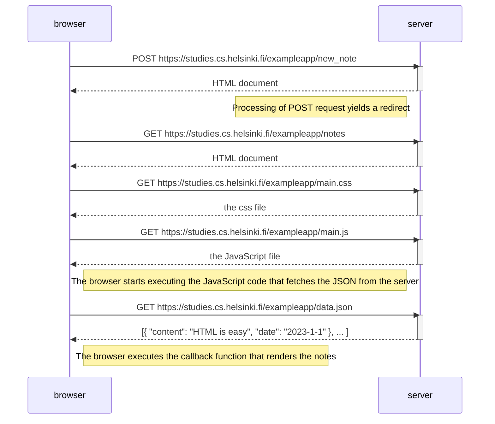

# Sequence Diagram: New Note
The new note is added to the page by POSTing the form to the server, which registers the new entry and redirects the user again to teh same page, where the js will load the newly edited json from the server, thus displaying the new note 

