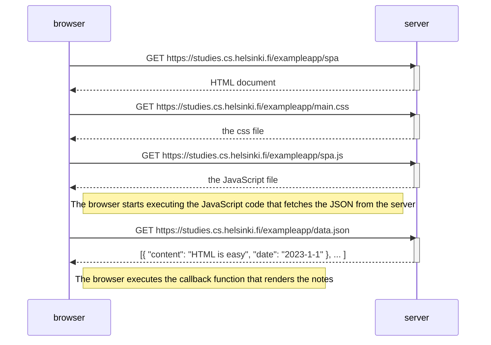

# Sequence Diagram SPA:
Loading the SPA is equivalent to the loading requests done for the normal app. The main difference here becomes notable when adding a new entry to the notes list. See [ex04](./ex04.md) VS [ex06](./ex06.md) to compare.

