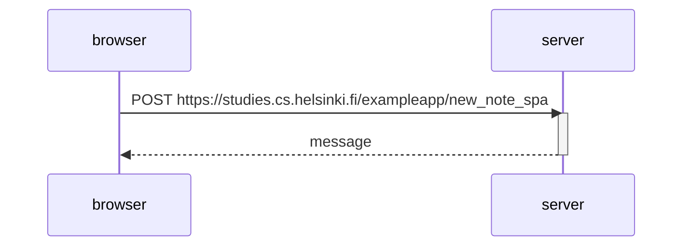

# Sequence Diagram New Note:
The addition of a new note is performed through js which handles the addition to the HTML document locally before POSTing the note to the server, which will then take care of updating the database on server side. 

Note that here no redirect is triggered when processing the POST request. 